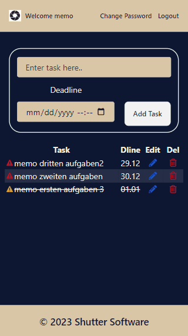

# [Project : Node Task Tracker Project](https://node-task-tracker.vercel.app/)
## Table of contents

  - [The challenge](#the-challenge)
  - [Screenshot](#screenshot)
  - [Built with](#built-with)
  - [Useful resources](#useful-resources)

## The challenge
Project aims to develop a safe task tracker; multiple users can signup, signin and use.

## Problem Statement

- Develop an app which requires email and password for signup. 
- Provides a verification link in email.
- Stores user passwords in the database as encrypted.
- Sends reset password link to user email address in case user forgets the password.
- Each user can see, update, delete his/her own tasks. 
- According to the deadline, app provides a warning sign (red for passed deadlines, orange for deadlines witihin 24 hours, yellow for deadlines within 48 hours. 

## Screenshot

### Project Information
- For backend Node.js and Express.js is used,
- Verification Emails and Reset Password Emails are being sent by using Sendgrid package,
- For encryption and decryption jwt package is used,
- For backend security; express-rate-limit, helmet, xss-clean, cors, express-mongo-sanitize packages are used,
- Token exchange between frontend and backend provided by adding double layered cookies (authentication token, refreshtoken),
- Front end developed by using React,
- Global state management is provided by using Redux-persist,
- For providing multipage experience to user, React Router Dom is used,
- For styling, traditidional Tailwind CSS is used.

------
I used;
- Node.js
- Express.js
- jwt
- Sendgrid
- React
- Redux-persist
- React Router
- Tailwind CSS

## Lesson Learned

- Before starting this project, I had very limited knowledge about CORS. During the project I have faced many difficulties related with CORS issues. During the deployment I have deployed my backend to Render and Frontend to Vercel. But project didn't work. After a long research I have learned that I had to use sameSite : "None" property when I was adding cookies to the response. And when sending requests from frontend to backend I had to add {withCredentials: "included"}.

### Useful resources

- [W3 Schoold](https://www.w3schools.com/) 
- [MDN](https://developer.mozilla.org/en-US/)
- [NODE.JS](https://nodejs.org/dist/latest-v16.x/docs/api/fs.html)
- [EXPRESS.JS](https://expressjs.com/)
- [JASONWEBTOKEN](https://jwt.io/introduction)
- [SENDGRID](https://sendgrid.com/en-us)
- [REACT](https://reactjs.org/) 
- [REACT ROUTER](https://reactrouter.com/en/main) 
- [TAILWINDCSS](https://styled-components.com/)

 &#8987; Happy Coding  &#9997; 

